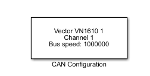

ft-sensors-simulink
===================

This repository hosts Simulink models to interface FT sensors.

Here below you can find instructions on how to use the model provided.

https://user-images.githubusercontent.com/38140169/148915847-2d39802b-c98d-402b-9fee-a78d4707910a.mp4

## Instructions

The following section describes how to read and write CAN messages of a FT45 sensor with Matlab/Simulink.

### Connect the hardware
1. Connect the FT45 sensor to the Strain programming board through the dedicated 6-pin connector
2. Use the 4-pin connector on the programming board to connect to the VN1610 Vector transceiver 
   - This connection is done through a CAN4 to ESD-CAN cable
   - The cable must be provided with a USB port, to supply power to the programming board and the sensor.
3. Connect the Vector to your PC USB port 
4. To turn on the FT sensor, connect the CAN4 to ESD-CAN USB port to your PC; a blue light on the sensor should start flashing.

See the picture below for an example of the setup.

### Launch the model
1. Double-click on the Simulink model `FT_CAN_messages.slx`. If the Vector is connected, you should see the *CAN configuration* block configured for it, like the picture below.

2. Click on the *Run* icon in Simulink top bar. The model will run until stopped manually.

### Start the data stream
You can use the dashboards on the left of the model to send messages to the sensor when the model is running. The picture below shows the one specifically designed for the FT sensor.

To start the stream of calibrated Force and Torque data, you must do the following operations:
1. Select the radio button called *Get full scale*
2. Set the constant value in the *Get regulation set* block; the value corresponds to the quantity for which you want to get the full scale: 

|||
|---|---|
|Force X| 0x00|
|Force Y|0x01|
|Force Z|0x02|
|Torque X|0x03|
|Torque Y|0x04|
|Torque Z|0x05|

3. Click on the button called *Send FT Msg*
4. Now select the radio button called *TX Start* and click the *Send FT Message* button
5. If all operations were performed successfully, you should start seeing the stream of data on the scopes on the right side, like in the picture; if you see a constant zero, you need to first get the full scale for those quantities.

